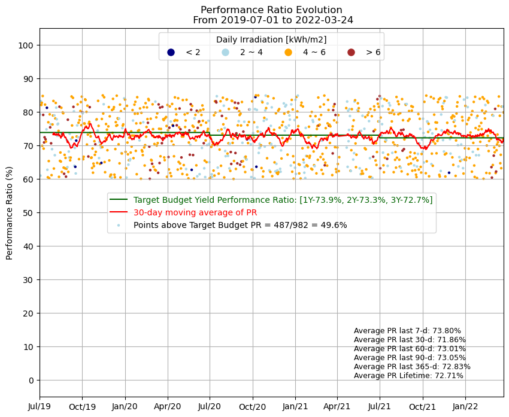

# Solar Data Analysis Project

This repository contains the code and data for analyzing solar performance ratios (PR) and global horizontal irradiation (GHI). The project includes data preprocessing, merging, and visualization scripts.

## Table of Contents
- [Description](#description)
- [Installation](#installation)
- [Usage](#usage)
- [Files](#files)
- [Contact](#contact)

## Description

This project aims to process and visualize solar data to evaluate performance ratios over time. It includes scripts to preprocess data, merge datasets, and generate visual representations of the data.

## Installation

To set up the project locally, follow these steps:

1. **Clone the repository**
   ```bash
   git clone [https://github.com/yourusername/solar-takehomequiz.git]
   cd solar-data-analysis
2. ** Ensure you have Python and Pip installed, then run:
   ```bash
   pip install -r requirements.txt

## Usage

### Preprocessing Data

To preprocess and merge GHI and PR data, run the following script:

    ```bash
    jupyter notebook preprocess.ipynb

This will generate a 'merged_data.csv' file containing the combined data, see: [merged_data.csv](merged_data.csv)

### Visualizing Data

To visualize the performance ratios and other metrics, run the script:

    ```bash
    jupyter notebook datavisualisation.ipynb

This script will generate visual outputs like 'output.png', see: 

## Files

- **Data/**: Contains the provided GHI and PR data.
- **README.md**: This file.
- **datavisualisation.ipynb**: Jupyter notebook for data visualization.
- **merged_data.csv**: Single CSV file containing all merged data points.
- **output.png**: Output graph generated from the visualization script.
- **preprocess.ipynb**: Jupyter notebook for preprocessing and merging data.
- **requirements.txt**: List of Python dependencies required for the project.


## Contact

For any inquiries or feedback, please contact E1332638@u.nus.edu.sg


  
  

